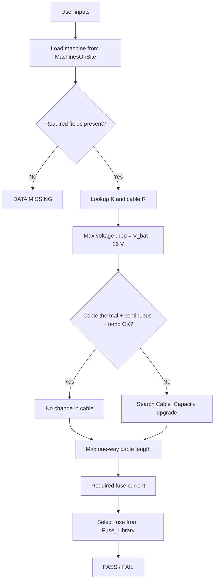

# GBA-0002 Client v0 — Calculation Reference

**Branch:** `client/v0`  
**Engine:** `packages/engine/src/gba0002/calculate.ts`  
**Spec reference:** GBA-0002 Vehicle database (2).pdf

This document explains **every calculation** performed by the v0 prototype, including where each input comes from, the exact formulas, and how they map to PDF line items.

**Related:** [`V0_MACHINE_PARAMETERS.md`](./V0_MACHINE_PARAMETERS.md) · [`GBA0002_SPEC_CLARIFICATION_MEMO.md`](./GBA0002_SPEC_CLARIFICATION_MEMO.md)

---

## 1. Calculation flow overview

---

## 2. Inputs

### 2.1 User inputs

| Symbol | Name | PDF | Validation |
|--------|------|-----|------------|
| \(SF\) | Safety factor (%) | 1 | Must be 25 or 50 |
| — | Machine model | 2 | Must be one of 9 client IDs |
| \(V_{bat}\) | Battery voltage during cranking (V) | 3 | \(0 < V_{bat} \leq 36\) |
| \(T_{site}\) | Operating temperature (°C) | 4 | Finite number |

### 2.2 Constants (hard-coded)

| Symbol | Name | PDF | Value |
|--------|------|-----|-------|
| \(V_{starter,min}\) | Minimum starter voltage | 5 | **16 V** |
| \(t_{crank}\) | Cranking time | 11 | **5 s** |

### 2.3 Machine inputs (MachinesOnSite lookup by column D)

| Symbol | JSON field | Col | Used in v0? |
|--------|------------|-----|-------------|
| \(I_{crank}\) | `peakCrankingCurrentA` | **T** | **Yes** — see §3 |
| \(I_{alt}\) | `alternatorContinuousA` | Z | Yes |
| — | `cableType` | AD | Yes (K lookup) |
| \(S\) | `cableSizeMm2` | AE | Yes |
| \(I_{cable,cont}\) | `cableContinuousA` | AG | Yes |
| — | `operatingTempC` | AF | Yes (record limit) |

### 2.4 Lookup inputs

| Symbol | Source | Rule |
|--------|--------|------|
| \(k\) | Copper_K_Factor | Match `cableType` to column A → read K from column B |
| \(R\) | Cable_Capacity | Match `cableSizeMm2` to column F → read Ω/km from column H |

---

## 3. The three starter currents — Q, T, and R

This section explains the confusion around **which current** to use. **v0 currently uses column T.** The PDF line item 9 points to column **Q**.

### 3.1 Column definitions (MachinesOnSite)

| Col | Header | JSON field | Meaning |
|-----|--------|------------|---------|
| **N** | Cut off voltage (V) | `cutoffVoltageV` | Starter terminal voltage assumed for power-based calculation (typically **16 V**) |
| **O** | Power at cut off voltage (kW) | `powerAtCutoffKw` | Mechanical power the starter must deliver at cutoff voltage |
| **P** | Efficiency (%) | `efficiencyPercent` | Starter motor efficiency (often 56.25% in the fleet) |
| **Q** | Peak current cut off (from power & eff) | `peakCurrentCutoffA` | **Calculated** electrical current limit — see §3.2 |
| **R** | Inrush current measured (A) | `inrushCurrentA` | **Measured** short-duration peak when starter engages |
| **T** | Peak continuous current during cranking (A) | `peakCrankingCurrentA` | **Measured/calculated** current during the sustained cranking period |

### 3.2 Where column Q comes from (Excel formula)

In the original Excel workbook, column **Q** is **not** a field measurement. It is computed from columns **N**, **O**, and **P** using starter-motor electrical theory from the PDF (page 2):

**Electrical power at the starter:**

\[
P_{elec} = \frac{P_{mech}}{\eta}
\]

where \(P_{mech}\) = power at cutoff (kW) and \(\eta\) = efficiency (decimal).

**Cranking current at cutoff voltage:**

\[
I = \frac{P_{elec}}{V_{cutoff}} = \frac{P_{mech\_kW} \times 1000}{\eta \times V_{cutoff}}
\]

**Worked example — D10T:**

| Input | Value |
|-------|-------|
| Power at cutoff \(P_{mech}\) | 9 kW |
| Efficiency \(\eta\) | 56.25% = 0.5625 |
| Cutoff voltage \(V_{cutoff}\) | 16 V |

\[
I_Q = \frac{9 \times 1000}{0.5625 \times 16} = \frac{9000}{9} = 1000\ \text{A}
\]

This matches column **Q** = 1000 A for D10T.

### 3.3 Why Q is called a “design limit”

Column **Q** answers: *“If the starter must deliver \(P_{mech}\) kW at \(V_{cutoff}\) V with efficiency \(\eta\), what electrical current does that imply?”*

It is a **theoretical ceiling** derived from rated power and efficiency — not a waveform measurement. In the full engineering tool (`main`), Q is used as a **pass/fail limit**:

\[
I_{crank} \leq I_Q \quad \text{(starter motor check)}
\]

while **T** is used as the **actual load** for cable thermal and voltage drop.

### 3.4 Column T — sustained cranking current

Column **T** is the peak current **during the cranking event** (the 5 s window). For D10T, **T = 500 A** while **Q = 1000 A**.

Physically, for adiabatic heating over **5 seconds**, the current that matters is the current **flowing during those 5 seconds** — which aligns with **T**, not the theoretical power-based limit **Q**.

### 3.5 Column R — inrush transient

Column **R** is the **measured inrush** (e.g. D10T: 1200 A). It is typically the highest, shortest-duration peak. It is relevant for very short fuse let-through or first-cycle thermal stress, but is **not used in v0**.

### 3.6 What v0 uses today

| Check | PDF says | v0 implementation |
|-------|----------|-------------------|
| Cable thermal (line 14–15) | \(I\) = line 9 → col **Q** | Uses **T** (`peakCrankingCurrentA`) |
| Max cable length (line 18) | Line 9 current | Uses **T** |
| Fuse withstand (line 20) | “Inrush” example 1000 A | Uses **T** (passed as `inrushA` in code — misnamed) |

See [`GBA0002_SPEC_CLARIFICATION_MEMO.md`](./GBA0002_SPEC_CLARIFICATION_MEMO.md) for questions to raise with the spec author.

---

## 4. Step-by-step calculations

### 4.1 Maximum allowable voltage drop (PDF line 6)

\[
\Delta V_{max} = V_{bat} - V_{starter,min} = V_{bat} - 16\ \text{V}
\]

**Fail** if \(\Delta V_{max} \leq 0\) — battery voltage is already at or below the minimum starter voltage.

**Example:** \(V_{bat} = 20\) V → \(\Delta V_{max} = 4\) V.

---

### 4.2 Cable resistance (PDF line 8)

Look up \(R\) in **Cable_Capacity** (Ω/km) for the machine’s cable size (column AE / `cableSizeMm2`).

**Fail** if no matching size in the table.

---

### 4.3 K-factor (PDF line 13)

Look up \(k\) in **Copper_K_Factor**: match cable type (column AD) to column A, read K from column B.

**v0:** strict lookup — no default K. **Fail** with “Engineering review required” if not found.

---

### 4.4 Cable thermal withstand (PDF lines 14–15)

**Adiabatic form (PDF line 14):**

\[
t_{thermal} = \left(\frac{k \cdot S}{I_{crank}}\right)^2
\]

**Pass** if \(t_{thermal} \geq t_{crank}\) (5 s).

**Equivalent peak capability form (PDF §7):**

\[
I_{peak,capability} = \frac{k \cdot S}{\sqrt{t_{crank}}}
\]

**Pass** if \(I_{crank} \leq I_{peak,capability}\).

The code uses the second form via `cableThermalWithstandPass()`.

**Example — D10T** (\(k=150\), \(S=70\) mm², \(I_{crank}=500\) A, \(t=5\) s):

\[
I_{peak,capability} = \frac{150 \times 70}{\sqrt{5}} = \frac{10500}{2.236} \approx 4695\ \text{A}
\]

Since \(500 \leq 4695\), thermal **passes**.

If PDF column **Q** (1000 A) were used instead:

\[
I_{peak,capability} \text{ unchanged}, \quad 1000 \leq 4695 \quad \text{still passes, but tighter margin}
\]

---

### 4.5 Cable continuous current (PDF line 17)

**Pass** if:

\[
I_{cable,cont} \geq I_{alt}
\]

Uses column **AG** (`cableContinuousA`) when cable recommendation is “no change”.

**Example — D10T:** \(314 \geq 95\) → pass.

---

### 4.6 Cable operating temperature (PDF lines 19, 4)

**Pass** if user-entered \(T_{site}\) is within the cable’s temperature limit (column AF on record, or Cable_Capacity column E for upgrades).

---

### 4.7 Cable recommendation (PDF line 16)

| Condition | Result |
|-----------|--------|
| Thermal **and** continuous **and** temp pass | **No change** — show existing type (AD) and size (AE) |
| Any fail | Search **Cable_Capacity** for smallest size that passes thermal, continuous, and temp |
| No upgrade found | **Unsuitable** — engineering must determine fit |

---

### 4.8 Maximum allowable one-way cable length (PDF line 18)

\[
L_{max} = \frac{\Delta V_{max} \times 1000}{I_{crank} \times 2 \times R}
\]

- **× 1000** — converts km (Ω/km) to metres  
- **× 2** — outbound and return conductors (loop resistance)

**Example — D10T** (\(\Delta V_{max}=4\) V, \(I_{crank}=500\) A, \(R=0.327\) Ω/km):

\[
L_{max} = \frac{4 \times 1000}{500 \times 2 \times 0.327} = \frac{4000}{327} \approx 12.23\ \text{m}
\]

If **Q = 1000 A** were used: \(L_{max} \approx 6.12\) m (half the length).

---

### 4.9 Required fuse current (PDF line 10 / sizing rule)

\[
I_{fuse,req} = I_{alt} \times \left(1 + \frac{SF}{100}\right)
\]

**Example — D10T**, \(SF=25\%\): \(I_{fuse,req} = 95 \times 1.25 = 118.75\) A.

---

### 4.10 Fuse selection (PDF lines 20–22)

Find the smallest fuse rating \(I_{fuse}\) from **Fuse_Library** such that:

1. \(I_{cable,cont} \geq I_{fuse} \geq I_{fuse,req}\)
2. Fuse **withstand time** at \(I_{crank}\) for ≥ 5 s (from MEGA32V curve or Fuse_Library graph time)
3. Fuse **temperature range** (column K) includes user \(T_{site}\)

**Withstand lookup:** `lookupWithstandTimeS(I_crank, rating, mega32vCurve, fuseRecord)`

**I²t alternative** (documented in PDF, used on `main` for audit):

\[
I^2 t_{required} = I_{crank}^2 \times t_{crank}
\]

\[
t_{withstand} = \frac{I^2 t_{fuse}}{I_{crank}^2}
\]

---

### 4.11 Overall PASS / FAIL

**PASS** when:

- Cable recommendation is not “unsuitable”
- Cable operating temperature passes
- Fuse found and passes withstand + temperature
- \(L_{max}\) is finite and &lt; 1000 m (sanity guard in code)

Otherwise **FAIL** or **ENGINEERING REVIEW REQUIRED** (bad K-factor, unrealistic voltage, unparseable temperature).

---

## 5. PDF line item → implementation map

| PDF line | Description | v0 formula / source |
|----------|-------------|---------------------|
| 1 | Safety factor | User 25 or 50% |
| 2 | Machine model | 9-machine list |
| 3 | Battery V cranking | User \(V_{bat}\) |
| 4 | Operating temp | User \(T_{site}\) |
| 5 | Min starter V | 16 V constant |
| 6 | Max voltage drop | \(V_{bat} - 16\) |
| 7 | Cable size | Col AE |
| 8 | Cable resistance | Cable_Capacity by size |
| 9 | Starter cranking current | **Col T in code** (PDF says Q) |
| 10 | Alternator continuous | Col Z |
| 11 | Cranking time | 5 s constant |
| 12 | Cable type | Col AD |
| 13 | K-factor | Copper_K_Factor |
| 14 | Thermal time | \((kS/I)^2\) |
| 15 | Thermal pass? | \(t_{thermal} \geq 5\) s |
| 16 | Cable recommendation | No change / upgrade / unsuitable |
| 17 | Cable continuous | Col AG ≥ alternator |
| 18 | Max one-way length | §4.8 |
| 19 | Cable temp range | Col AF vs user temp |
| 20 | Fuse size | Library + withstand |
| 21 | Fuse make / part | Fuse_Library |
| 22 | Fuse temp range | Fuse_Library col K |

---

## 6. Code references

| Function | File | Purpose |
|----------|------|---------|
| `calculateGba0002` | `gba0002/calculate.ts` | Main orchestrator |
| `computeCableThermalWithstandTimeS` | `gba0002/calculate.ts` | \((kS/I)^2\) |
| `computeMaxAllowableOneWayLengthM` | `gba0002/calculate.ts` | Line 18 |
| `cableThermalWithstandPass` | `gba0002/helpers.ts` | Peak capability check |
| `requiredFuseCurrentA` | `gba0002/helpers.ts` | Fuse sizing |
| `lookupKFactorStrict` | `gba0002/helpers.ts` | K without default |
| `selectFuse` | `gba0002/calculate.ts` | Fuse library search |

---

## 7. Design disclaimer

These calculations follow GBA-0002 and standard LV sizing practice. They are a **design aid** — not a substitute for AS/NZS verification, manufacturer datasheets, fault-current rating, installation derating, or sign-off by a qualified engineer.
